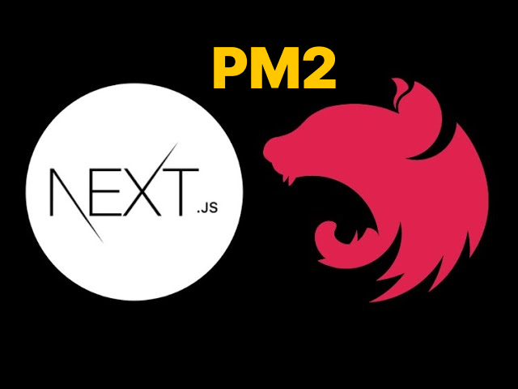

# Start Serviçe Nextjs, Nestjs com pm2



Esse Readme é uma breve configuração de como é iniciado uma aplicação em nextjs e nestjs com pm2 e configurando
para aplicação ser iniciado quando a maquina

## Start Nextjs

```bash
# Navegar até o diretório do projeto Next.js
cd /caminho/para/seu/projeto/nextjs

# Construir a aplicação para produção
npm run build

# Iniciar a aplicação com um nome personalizado
sudo pm2 start npm --name "frontend" -- start

```

## Start Nestjs

```bash
# Navegar até o diretório do projeto NestJS
cd /caminho/para/seu/projeto/nestjs

# Construir a aplicação para produção
npm run build

# Iniciar a aplicação com um nome personalizado
sudo pm2 start dist/main.js --name "backend"
```

### Configurar PM2 para iniciar na inicialização do sistema e salvar os processos:

```bash
# Configurar PM2 para iniciar na inicialização do sistema
sudo pm2 startup

# Execute o comando gerado pelo comando anterior (substitua pelo comando específico gerado para o seu sistema)
sudo env PATH=$PATH:/usr/bin pm2 startup systemd -u <user> --hp /home/<user>

# Salvar os processos em execução
sudo pm2 save

# Verificar se os serviços foram configurados corretamente
pm2 list

```

Para reiniciar o Ubuntu, você pode usar o seguinte comando no terminal:

```bash
sudo reboot
```
